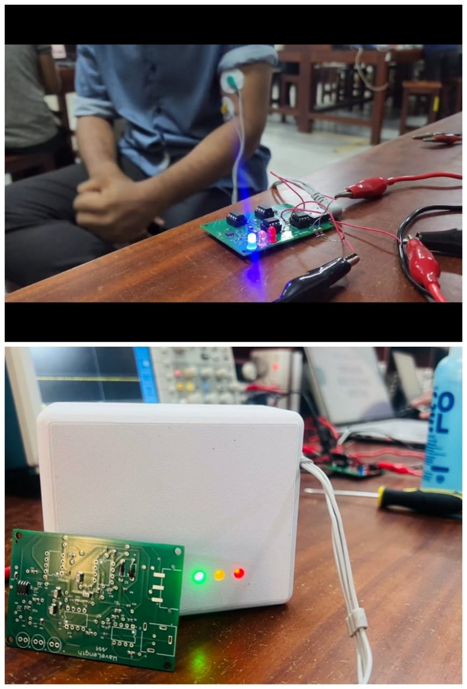
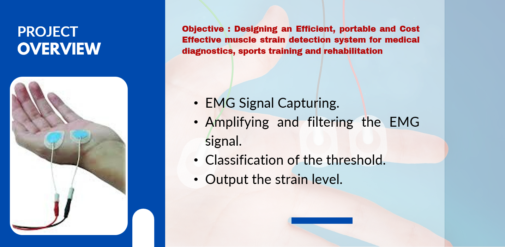
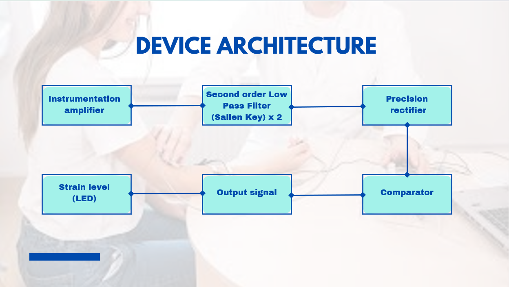

# EMG-Muscle-Strain-Detector
A fully analog EMG-based muscle strain detector with real-time LED feedback

## Key Features:
- A portable device made entirely by analog components that effectively monitors EMG signals using three wet electrodes.
- Real-time feedback with LEDs indicating strain levels (low, medium, high).
- Powered by two 9V batteries for extended usage and portability.
- Incorporates an instrumentation amplifier, second-order low-pass filters, a precision full-wave rectifier, and a comparator for efficient EMG signal processing

## How to Use
1. Connect three wet electrodes to the designated locations.
2. Power the device using two 9V batteries.
3. Observe the LED indicators for strain level feedback.

# 💪 EMG Muscle Strain Detector

A **fully analog, wearable EMG-based muscle strain detector** that provides real-time LED feedback for monitoring muscle strain levels during physical activity or rehabilitation sessions.

---

## 🧠 Project Overview

This compact device uses **surface EMG signals** collected via wet electrodes to detect muscle activation and strain levels. It's designed for portability and real-time usability without the need for a microcontroller or display.

---

## 🔑 Key Features

- ⚡ **100% Analog Design** — No microcontroller required
- 🟢🟡🔴 **Real-time LED Feedback** — Indicates strain levels: Low, Medium, High
- 🔋 **Powered by Dual 9V Batteries** — Ensures extended and portable operation
- 🧪 **Analog Signal Processing Pipeline**:
  - Instrumentation amplifier (for differential signal capture)
  - Second-order low-pass filters (for noise removal)
  - Full-wave rectifier (for signal conditioning)
  - Comparator (for level detection and LED output)

---

## 📊 Block Diagram

Here’s a visual representation of the signal flow and components:

---

## 🚀 How to Use

1. 🧷 **Attach three wet electrodes** to the target muscle area.
2. 🔌 **Power the device** using two 9V batteries (one for op-amps, one for reference).
3. 🔦 **Observe the LED indicators** to determine strain level:
   - 🟢 Low strain
   - 🟡 Medium strain
   - 🔴 High strain

---

## 🛠️ Built With

- Op-amps (e.g., TL072, LM324)
- Passive analog components (resistors, capacitors, diodes)
- LEDs and comparators
- EMG surface electrodes

---
